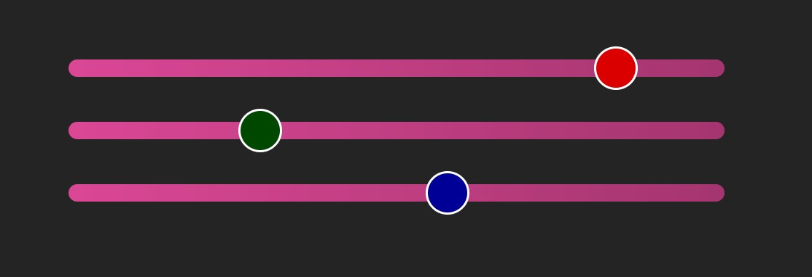
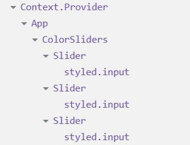

# RGB color mixer
Zadání na procvičení createContext, useContext, useState, předávání dat přes props.

Pracujte samostatně a jen s použitím oficiální dokumentace – tedy [MDN](https://developer.mozilla.org/en-US/) a [React.dev](https://react.dev/).

Vytvořte část formuláře pro nastavení určité barvy v 24bit RGB. (Jiná část aplikace, kterou zde nerealizujete by následně s vybranou barvou pracovala - bude dostupná v Contextu.)

## Požadavky
* Komponenta `<App />` integruje pouze vámi vytvořený kontejner (komponentu) se třemi posuvníky.
* Pro dokončení vizuálu (UI) použijte CSS module ve vámi vytvořeném kontejneru. (Zachovejte funkčnost *light* i *dark* mode.)
* Veškerá data pro posuvníky budou čerpána z Context aplikace (připojeného v `main.tsx`).
* Z Context bude dostupná i metoda pro nastavení změny barvy.
* Jako posuvník použijte již nastylovaný Slider typu `<input type="range">` – máte jej k dispozici v `StyledSlider.tsx`.
* Posuvník Slideru bude znázorňovat výslednou (RGB) barvu. (Props `backgroundColor` je CSSProperties - Color)
* Ovládací prvek na Slideru bude znázorňovat vždy pouze "svou" barevnou složku (R nebo G nebo B). (Props `thumbColor` je CSSProperties - Color)
* Změny se projeví při každém posunutí ovládacího prvku (událost `onChange`).

## Možný vzhled UI


## Rady a doporučené postupy

### Očekávaná struktura komponent:


### Příklad použití Slideru:
```jsx
<StyledSlider
  min={0}
  max={255}
  value={200}
  onChange={(e) => {let colorValue = parseInt(e.currentTarget.value); console.log(colorValue)}}
  backgroundColor={}
  thumbColor={}
/>
```

Nezapomeňte, že s barvami lze v CSS pracovat prostřednictvím funkce `rgb()` ... např: `rgb(200, 160, 80)`

### Doporučená struktura dat v Context Provideru:
```jsx
type colorType = { R: number, G: number, B: number };

type stateType = { 
    color: colorType
    changeColor: (color: colorType) => void
};

const initialState: stateType = { 
    color: {R: 0, G: 0, B: 0 }, 
    changeColor: (color: colorType) => { console.log(color)} 
};
```
